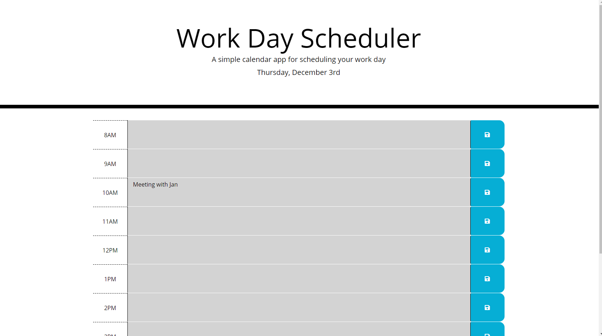
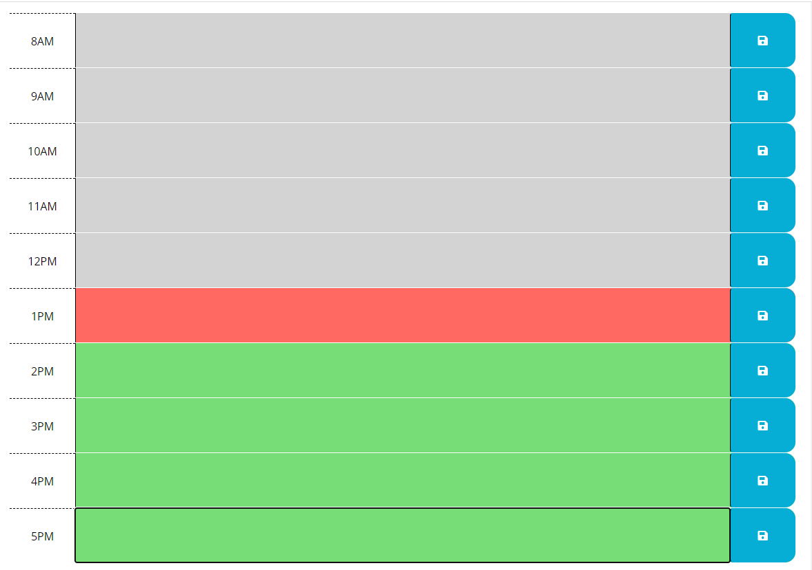

# Work-Day-Scheduler
Description

The purpose of this project was to create a simple calendar application that allows a user to save events for each hour of the day by modifying starter code. This app runs in the browser and feature dynamically updated HTML and CSS powered by jQuery. This project included several parts. Firstly, I had to create the HTML for the boxes that would allow a user to type in them, with a save button on the side of each. Then I had to make the save button functional so when it was clicked, whatever was typed in a given box would be saved to local storage. Next, I had to make sure that stored content would be displayed on the page even if the page was refreshed. This required creating a "for" loop so that each box would be checked for saved text and would be displayed on the page refresh. Lastly, the client required the colors of the boxes change based on the hour it was currently. This was the most simple part, by creating a "forEach" Jquery function, and if/else statements insides of these, I could manipulate the class of each box to change the color based on the current time. The current time was powered by Moment.js, so it could be manipulated to create all of these aspects.

I did add one unspecified part of the project. I added a clear button so you can clear out any localStorage that was previously saved. This improves its testability and makes it fairly functional as a Work Day Scheduler. 

The most challenging part of this project was working with "localStorage", especially the ".getItem" aspect of this project. It took many unsuccessful tries to create the right perameters to make that text stay on the page even after refresh. I am very happy that I was able to successfully complete it. 

I think I could improve this project by allowing the option to pick future dates and add events as you pleased so you can actually plan ahead rather than just on the day. I think that would make it a fully functional Scheduler. 

Installation

None required, just follow link https://julieanni.github.io/Work-Day-Scheduler/.

Usage

This project can be used to schedule your time for a single day. You can return to the page at any time and the items you have typed in the boxes will remain until you decide to clear them out using the clear button. The time is updated actively every time the page is refreshed, this means the day will change and the color of the boxes will change depending on what time of day it is. If you take a look at the two images below, the first will show how the day will change in the header to reflect the current day. It also demonstrates the ability to type in the boxes. The second image shows how the time of day affects what color the boxes are: hours past are gray, the current hour is red, and hours yet to pass are green.

Credits
Thank you to my instructor and TA's who helped answer questions and taught me how to make this project possible. Completing this project would not have been possible without guidance from my father, a fellow Programmer. I used bootstrap for formatting and fontawesome to create the clear button. 
License
MIT License 

Copyright (c) 2020 JulieAnnI

Permission is hereby granted, free of charge, to any person obtaining a copy
of this software and associated documentation files (the "Software"), to deal
in the Software without restriction, including without limitation the rights
to use, copy, modify, merge, publish, distribute, sublicense, and/or sell
copies of the Software, and to permit persons to whom the Software is
furnished to do so, subject to the following conditions:

The above copyright notice and this permission notice shall be included in all
copies or substantial portions of the Software.

THE SOFTWARE IS PROVIDED "AS IS", WITHOUT WARRANTY OF ANY KIND, EXPRESS OR
IMPLIED, INCLUDING BUT NOT LIMITED TO THE WARRANTIES OF MERCHANTABILITY,
FITNESS FOR A PARTICULAR PURPOSE AND NONINFRINGEMENT. IN NO EVENT SHALL THE
AUTHORS OR COPYRIGHT HOLDERS BE LIABLE FOR ANY CLAIM, DAMAGES OR OTHER
LIABILITY, WHETHER IN AN ACTION OF CONTRACT, TORT OR OTHERWISE, ARISING FROM,
OUT OF OR IN CONNECTION WITH THE SOFTWARE OR THE USE OR OTHER DEALINGS IN THE
SOFTWARE.